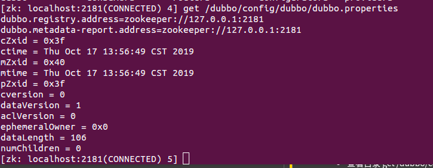
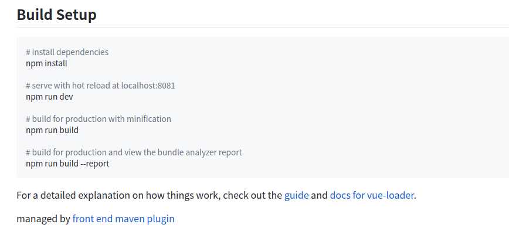
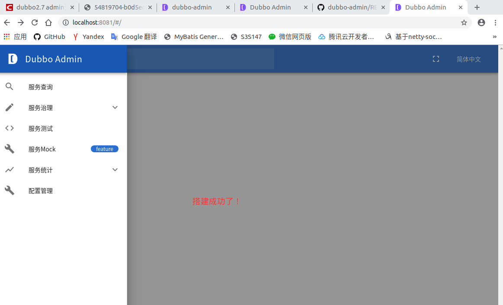
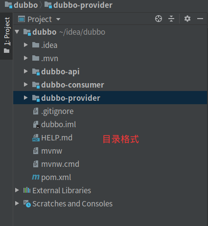
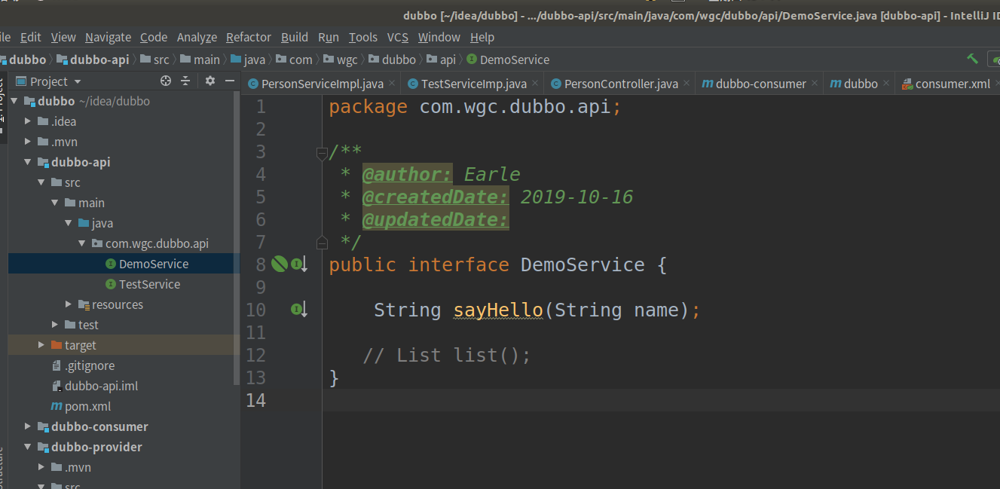
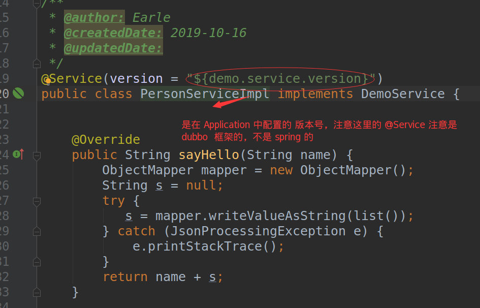
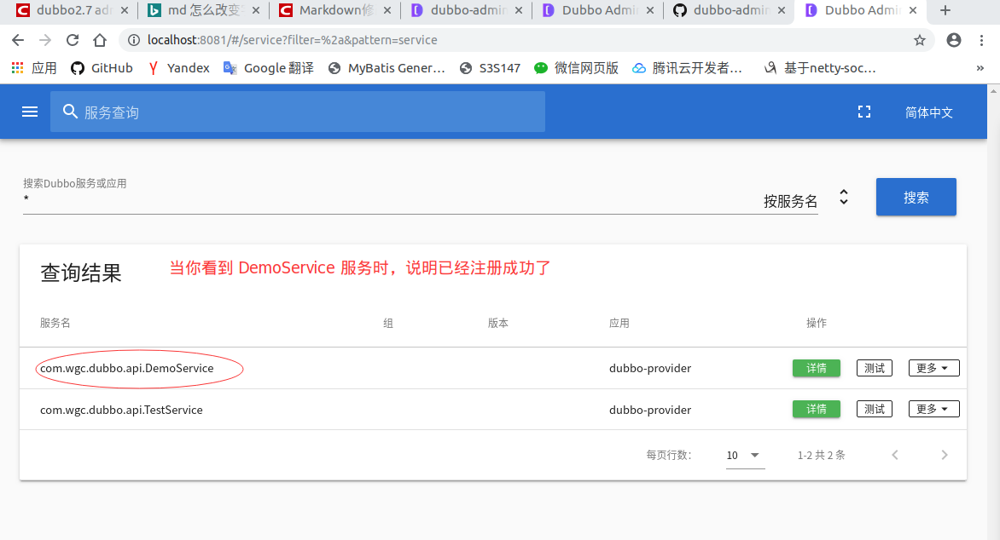
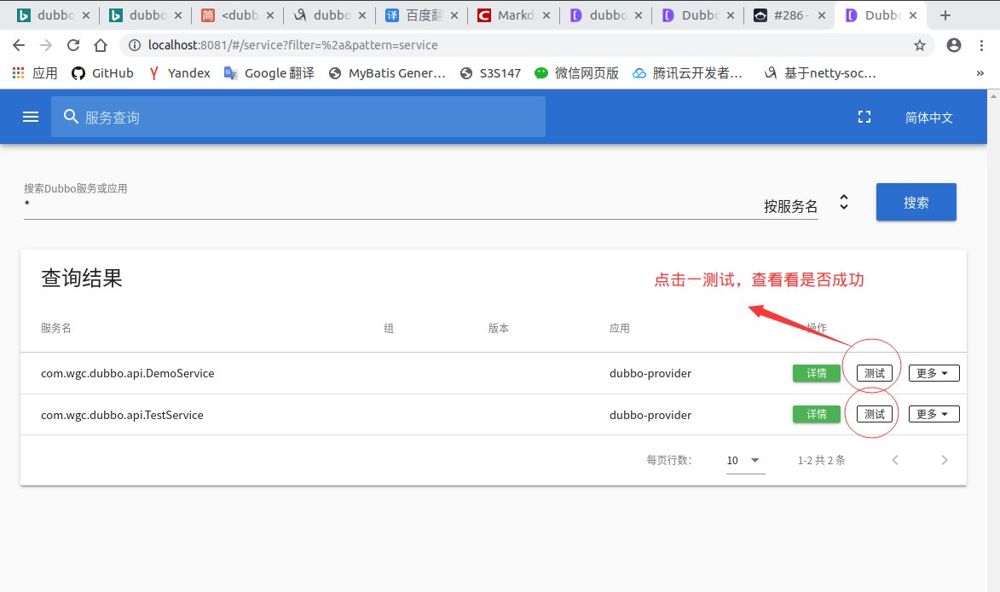
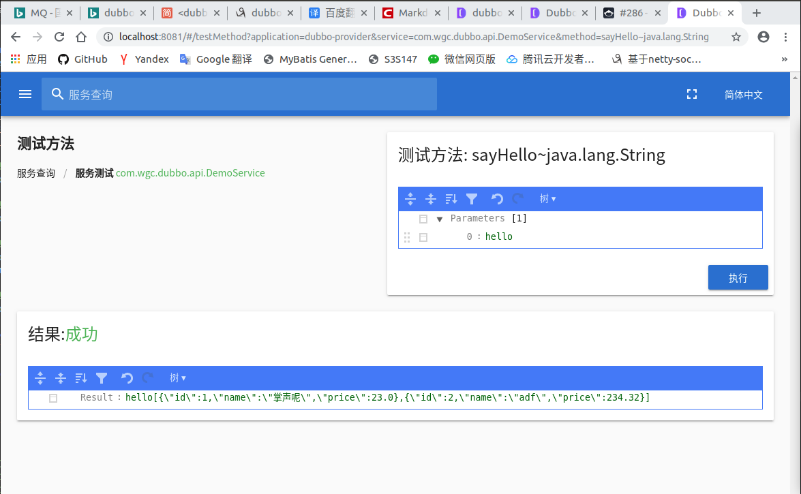

## spring boot 集成 dubbo + zookeeper

### 一、配置环境（本人使用的配置环境如下：）


-  java     1.8
-  zookeeper  3.4.12
-  dubbo  2.7.3
-  spring boot 2.2.0


### 二、使用的 jar  如下：

``` xml

        <!-- zookeeper  -->
        <dependency>
            <groupId>org.apache.zookeeper</groupId>
            <artifactId>zookeeper</artifactId>
            <version>3.4.12</version>
            <scope>compile</scope>
        </dependency>

        <!-- zookeeper common -->
        <dependency>
            <groupId>org.apache.curator</groupId>
            <artifactId>curator-framework</artifactId>
            <version>4.0.1</version>
            <scope>compile</scope>
        </dependency>

        <!-- zookeeper common -->
        <dependency>
            <groupId>org.apache.curator</groupId>
            <artifactId>curator-recipes</artifactId>
            <version>4.1.0</version>
            <scope>compile</scope>
        </dependency>

        <!--  dubbo  -->
        <dependency>
            <groupId>org.apache.dubbo</groupId>
            <artifactId>dubbo</artifactId>
            <version>2.7.3</version>
        </dependency>

```

### 三、去 [github](https://github.com/apache/dubbo-admin) 把  dubbo-admin 项目拷到本地使用

1、先把自己的 zookeeper 服务先启动

2、配置 dubbo-admin 服务（访问的端口是 [localhost:8080](http://localhost:8080)）

  - 在   ConfigCenter  类中添加如下代码：

    -  官网叙述： 由于在Dubbo2.7中，配置中心和注册中心做了分离，并且增加了元数据中心，因此Dubbo Admin的配置方式也做了更新

```  java

    @PostConstruct
    public void init() throws Exception {
        CuratorFramework zkClient = CuratorFrameworkFactory.builder().
                connectString("127.0.0.1:2181").
                retryPolicy(new ExponentialBackoffRetry(1000, 3)).build();
        zkClient.start();

        if (zkClient.checkExists().forPath("/dubbo/config/dubbo/dubbo.properties") == null) {
            zkClient.create().creatingParentsIfNeeded().forPath("/dubbo/config/dubbo/dubbo.properties");
        }
        zkClient.setData().forPath("/dubbo/config/dubbo/dubbo.properties", ("dubbo.registry.address=zookeeper://127.0.0.1:2181\n" +
                "dubbo.metadata-report.address=zookeeper://127.0.0.1:2181").getBytes());
    }


```

- 如果不添加也可以，只是我们无法看到“元数据”

- 当我们添加完成后，可以去查看 zookeeper 的目录中是否有 init() 方法添加的两条数据

``` properties 
    dubbo.registry.address=zookeeper://127.0.0.1:2181
    dubbo.metadata-report.address=zookeeper://127.0.0.1:2181

```

- 查看目录  **get /dubbo/config/dubbo/dubbo.properties** 



3、配置  dubbo-admin-ui 页面（访问的端口是 [localhost:8081](http://localhost:8081) ）



4、 配置完成后，启动服务看一看 ui 页面是否成功



### 四、自己搭建一个 Spring Boot 项目（[本人搭建的项目]()）

1、搭建的目录格式



2、在 **dubbo-api** 项目中创建一个接口比如：（DemoServcie）



3、在 **dubbo-provider**  提供者项目中创建一个实现类，实现 DemoService 接口



``` yml
# application.yml 版本号，配置
demo:
    service:
        version:  1.0.0

```

-  <font color="red">（重点）</font>  创建一个 <font color="red"> provider.xml</font>  文件

```  xml
<?xml version="1.0" encoding="UTF-8"?>
<beans xmlns="http://www.springframework.org/schema/beans"
       xmlns:xsi="http://www.w3.org/2001/XMLSchema-instance" xmlns:dubbo="http://dubbo.apache.org/schema/dubbo"
       xsi:schemaLocation="http://www.springframework.org/schema/beans http://www.springframework.org/schema/beans/spring-beans.xsd http://dubbo.apache.org/schema/dubbo http://dubbo.apache.org/schema/dubbo/dubbo.xsd">

    <!-- 注册的项目名字 -->
    <dubbo:application name="dubbo-provider"/>

    <!-- 注册中心，配置 zookeeper -->
    <dubbo:registry address="zookeeper://127.0.0.1:2181"/>

    <!--  -->
    <dubbo:provider  timeout="1000"/>

    <!-- 提供者使用的协议， 和端口号 -->
    <dubbo:protocol name="dubbo" port="20880"/>

    <bean id="demoService" class="com.wgc.dubbo.service.impl.PersonServiceImpl"/>

    <!-- 注册的服务 -->
    <dubbo:service interface="com.wgc.dubbo.api.DemoService" ref="demoService"/>

</beans>

```

- 在 SpringBoot 的启动类中引入  <font color="red"> provider.xml </font>   文件

``` java
@SpringBootApplication
@ImportResource("classpath:dubbo/provider.xml")
public class DubboProviderApplication {

    public static void main(String[] args) throws IOException {
        SpringApplication.run(DubboProviderApplication.class, args);
     /*  ClassPathXmlApplicationContext context = new ClassPathXmlApplicationContext(new String[] {"classpath:dubbo/provider.xml"});
        context.start();
        System.in.read();*/
       // GenericApplicationContext context = new GenericApplicationContext();
       // new GroovyBeanDefinitionReader(context).loadBeanDefinitions("dubbo/provider.xml");
       // context.refresh();
       // System.in.read();
    }

}

```

- 如果启动的报错，报错信息说 **provider.xml** 文件已经存在，那么你可以这个文件删了，重新创建一个新的，在启动项目

- 启动项目效果如下：
  
  

  4、在 **dubbo-consumer**  消费者项目中创建一个  <font color="red" size="4px">  consumer.xml </font> 

``` xml

<?xml version="1.0" encoding="UTF-8"?>
<beans xmlns="http://www.springframework.org/schema/beans"
       xmlns:xsi="http://www.w3.org/2001/XMLSchema-instance" xmlns:dubbo="http://dubbo.apache.org/schema/dubbo"
       xsi:schemaLocation="http://www.springframework.org/schema/beans http://www.springframework.org/schema/beans/spring-beans.xsd http://dubbo.apache.org/schema/dubbo http://dubbo.apache.org/schema/dubbo/dubbo.xsd">

    <!-- 服务名 -->
    <dubbo:application name="dubbo-consumer"/>

    <!-- 注册中心连接 zookeeper 地址 -->
    <dubbo:registry address="zookeeper://127.0.0.1:2181"/>

    <!-- 访问的服务接口， version 版本号，一定要与提供者一致 -->
    <dubbo:reference id="demoService"  interface="com.wgc.dubbo.api.DemoService" version="1.0.0"/>

    <!-- @Service 和 @Reference 的扫描 -->
    <dubbo:annotation package="com.wgc.dubbo.controller" />

</beans>
```

- **@Reference** 调用服务：


``` java 

/**
 *  Controller 层调用
 * @author: Earle
 * @createdDate: 2019-10-17
 * @updatedDate:
 */
@RestController
@RequestMapping("/person")
public class PersonController {

    @Reference
    private DemoService demoService;

    @GetMapping
    public List list() throws IOException {
        String hello = demoService.sayHello("");
        ObjectMapper mapper = new ObjectMapper();
        List list = mapper.readValue(hello, List.class);
        return list;
    }
}


```

``` java

// 启动服务
@SpringBootApplication
@ImportResource("classpath:dubbo/consumer.xml")
public class DubboConsumerApplication {

    public static void main(String[] args) throws IOException {

        SpringApplication.run(DubboConsumerApplication.class, args);
        //ClassPathXmlApplicationContext context = new ClassPathXmlApplicationContext("dubbo/consumer.xml");
        //context.start();
        //System.in.read();
 /*       DemoService demoService = (DemoService) context.getBean("demoService");
        String hell = demoService.sayHello("hell");
        System.out.println(hell);*/
    }

}

```

5、测试的结果如下：





6、如果不能进行测试，说明在配置 dubbo-admin 项目时，你的“元数据”没有配置好