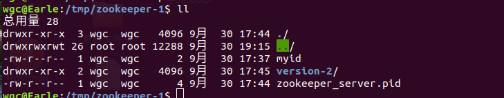

## 一、ZooKeeper 安装

[1、ZooKeeper 下载官网](http://archive.apache.org/dist/zookeeper)

2、配置 JAVA 环境， 检查环境：java -version

3、下载并解压 zookeeper

        tar -zxvf  zookeeper-3.4.12

4、重命名配置文件

        cp  conf/zoo_sample.cfg  conf/zoo.cfg

5、启动 zookeeper 

        bin/zkServer.sh start

6、启动 zookeeper 客户端连接服务端

        bin/zkCli.sh

## 二、JAVA 连接 ZooKeeper

1、导入 zookeeper 

```xml

<dependency>
    <groupId>org.apache.zookeeper</groupId>
    <artifactId>zookeeper</artifactId>
    <version>3.4.12</version>
</dependency>

```

2、JAVA  实现连接

```java
package com.earle.zk;

import org.apache.zookeeper.KeeperException;
import org.apache.zookeeper.WatchedEvent;
import org.apache.zookeeper.Watcher;
import org.apache.zookeeper.ZooKeeper;
import org.apache.zookeeper.data.Stat;

import java.io.IOException;
import java.util.concurrent.CountDownLatch;

/**
 * @author: Earle
 * @createdDate: 2019-9-30
 * @updatedDate:
 */
public class ZooKeeperLeader implements Watcher {

    /**
     * JDK 5+里面闭锁的一个实现，允许一个或者多个线程等待某个事件的发生
     * CountDownLatch有一个正数计数器，
     * countDown()方法对计数器做减操作，
     * await()方法等待计数器达到0。
     * 所有await的线程都会阻塞直到计数器为0或者等待线程中断或者超时。
     */
    private static CountDownLatch countDownLatch = new CountDownLatch(1);

    /**
     *  zookeeper 对象
     * */
    private static ZooKeeper zk = null;

    /**
     * zookeeper 的数据状态
     */
    private static Stat stat = new Stat();


    public static void main(String[] args) throws IOException, InterruptedException, KeeperException {

        String path = "/username";

        /**
         * 创建一个 zookeeper
         * */
        zk = new ZooKeeper("192.168.168.220:2181", 5000, new ZooKeeperLeader());
        
        // 获取数据
        byte[] data = zk.getData(path, true, stat);

        System.out.println(new String(data));

        Thread.sleep(Integer.MAX_VALUE);
    }

    @Override
    public void process(WatchedEvent event) {
        if (Event.KeeperState.SyncConnected == event.getState()) {
            if (Event.EventType.None == event.getType() && null == event.getPath()) {
                countDownLatch.countDown();
                // 通过 zookeeper 的监听通知机制获取到数据的变化
            } else if (event.getType() == Event.EventType.NodeDataChanged) {
                try {
                    // 在去获取数据
                    byte[] data = zk.getData(event.getPath(), true, stat);
                    System.out.println("配置已经修改，新值为：" + new String(data));
                } catch (KeeperException e) {
                    e.printStackTrace();
                } catch (InterruptedException e) {
                    e.printStackTrace();
                }

            }

        }
    }
}


```

## 三、ZooKeeper 集群配置

1、配置说明


2、再从 zoo-1.cfg 复制两个配置文件 zoo-2.cfg 和 zoo-3.cfg, 只需要修改 dataDir 和 clientPort 不同即可


3、修改 zoo-1.cfg，zoo-2.cfg，zoo-3.cfg 文件


3、创建三个  zookeeper-1、zookeeper-2、zookeeper-3  文件夹，三个文件夹都创建一个 myid 文件（我这里实在 /tmp  目录创建的）


4、每个文件夹都创建一个 myid 文件



5、创建的 myid 文件依次写入 1， 2， 3


6、启动各个服务

-  bin/zkServer.sh start confg/zoo-1.cfg
-  bin/zkServer.sh start confg/zoo-2.cfg
-  bin/zkServer.sh start cofng/zoo-3.cfg
  

7、启动客户端

- bin/zkCli.sh -server 127.0.0.1:2181
  

  8、启动服务后常常遇到的错误


如果遇到错误，久久无法解决，第一从图中寻找答案，如果第一不行，那么你就把 zookeeper 的版本换成 3.4.12 的，3.4.12 以上的版本都有可能和你 java 版本不一致。

9、根据 第二 JAVA 实现连接 ZooKeeper  创建 Leader、Follower 类就可以了，实现集群连接了。